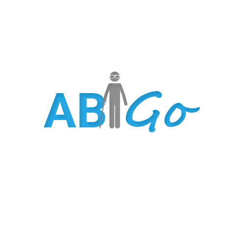

# Abigo

## About

---------------------------

This product is a communicating tool that aims to provide a better way of living for the differently abled deaf, dumb and blind community. At present, there is a considerable amount of such differently abled people in varying ages and most of them find it inconvenient to communicate with others unless they have help with them at all times.

Primary goal is to provide means of enhancing their lifestyles and making their day to day activities more convenient.

This product aims to bridge this gap of communication that exists by an end to end encrypted communicating application that is available in many languages. 

## Special Features

---------------------------

* End-to-end encrypted communication facility.
* Available in many languages
* Group conversations facility
* Built-in self-learning assistant to guide the user.

  During registration, the user would be able to define whether he is deaf, dumb or blind and using this categorization the application would be able to guide the user throughout the process thereafter.

* User recognition through face-recognition or name or voice.
* Translate the conversation that the required language by the user.

## Target Users

---------------------------

* Deaf, Dumb and Blind people - Mainly focused
* Any person - Additionally

Though this is mainly focused on the differently-abled people, even normal people can use this app to make their day-to-day life easier since this is a voice app that can be used with voice interacting the in-built assistant.
User interaction

> Sign language will be available as images that are different from a country to country. By crowdsourcing, contributors can add images according to their country. Meaning of the sign will be converted into text and to speech.
